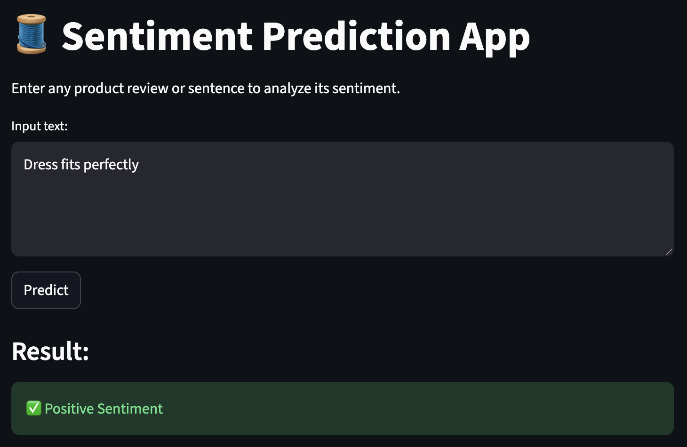

# Women Clothing E-commerce Reviews Sentiment Analysis


## 🌐 App Preview



## Project Description
This project focuses on sentiment analysis of women's clothing e-commerce reviews. It aims to classify reviews as positive, neutral or negative, providing insights into customer satisfaction and product performance. The solution includes data preprocessing, model training, and a deployment strategy using Streamlit.

## Features
- **Data Preprocessing**: Cleaning and transforming raw text data for sentiment analysis.
- **Sentiment Model Training**: Training a machine learning model to classify review sentiment.
- **Model Persistence**: Saving and loading trained models and vectorizers for efficient deployment.
- **Interactive Web Application**: A user-friendly Streamlit application for real-time sentiment prediction.
- **Scalable Deployment**: Hosted on Streamlit Cloud for easy access and demonstration.

## Project Structure
```
. Women Clothing/
├── artifacts/                            # Stored trained models and vectorizers
│   ├── final_sentiment_pipe_v2.pkl
│   ├── final_sentiment_pipe.pkl
│   ├── losgitic_reg_basline.pkl
│   ├── sentiment_pipe.joblib
│   └── tfidf_vectorizer.pkl
├── checking_pipe.py                      # Script for pipeline checking
├── configs/                              # Configuration files
│   └── config.yaml
├── data/                                 # Raw and processed data
│   ├── processed/
│   │   ├── test.csv
│   │   ├── train.csv
│   │   └── val.csv
│   └── raw/
│       └── womens_clothing_ecommerce_reviews_balanced.csv
├── infra/                                # Infrastructure-related files (e.g., environment setup)
│   └── environment.dev.yml
├── notebooks/                            # Jupyter notebooks for experimentation and analysis
│   └── phase1_data_audit.ipynb
├── quick_import_test.py                  # Quick test for imports
├── quick_model_test.py                   # Quick test for model
├── README.md                             # Project README file
├── requirements.txt                      # Python dependencies
└── src/                                  # Source code
    ├── app/                              # Streamlit application
    │   └── serve.py
    ├── data/                             # Data loading and utilities
    │   └── loader.py
    ├── diagnostics/                      # Diagnostic scripts
    │   └── sanity.py
    ├── eval/                             # Evaluation metrics
    │   └── metrics.py
    ├── features/                         # Feature engineering (text preprocessing, vectorization)
    │   ├── persist.py
    │   ├── text_prep.py
    │   └── vectorize.py
    └── models/                           # Model training, persistence, and baselines
        ├── baselines.py
        ├── persist.py
        └── train_pipeline.py

```

## Setup and Installation

1.  **Clone the repository:**

    ```bash
    git clone https://github.com/MosabAhmed92/Women-Clothing-Sentiment-Analysis.git](https://github.com/MosabAhmed92/Women-Clothing---NLP.git
    cd Women-Clothing-Sentiment-Analysis
    ```

2.  **Create a virtual environment (recommended):**

    ```bash
    python -m venv venv
    source venv/bin/activate  # On Windows, use `venv\Scripts\activate`
    ```

3.  **Install dependencies:**

    ```bash
    pip install -r requirements.txt
    ```

## Usage

### Running the Streamlit Application

To run the sentiment analysis web application locally:

```bash
streamlit run src/app/serve.py
```

The application will open in your web browser, usually at `http://localhost:8501`.

### Training the Model

To retrain the sentiment analysis pipeline, you can run the training script:

```bash
python src/models/train_pipeline.py
```

This will train the model using the data in `data/processed/` and save the trained pipeline to the `artifacts/` directory.

## Deployment

The Streamlit application is deployed on Streamlit Cloud. You can access the live application [here](https://women-clothing---nlp-dtit6tygwvfkeumoswifp6.streamlit.app/).

## Technologies Used
- **Python**
- **Streamlit**
- **scikit-learn**
- **pandas**
- **numpy**
- **NLTK**

## Future Enhancements
- Experiment with more advanced NLP models (e.g., BERT, transformers).
- Implement continuous integration/continuous deployment (CI/CD) pipeline.
- Add more detailed model evaluation metrics and visualizations.

## Contact & Author

- **Author**: Mosab Ahmed / Mosab Ahmed92


Feel free to connect or open an issue if you have any questions or suggestions!
